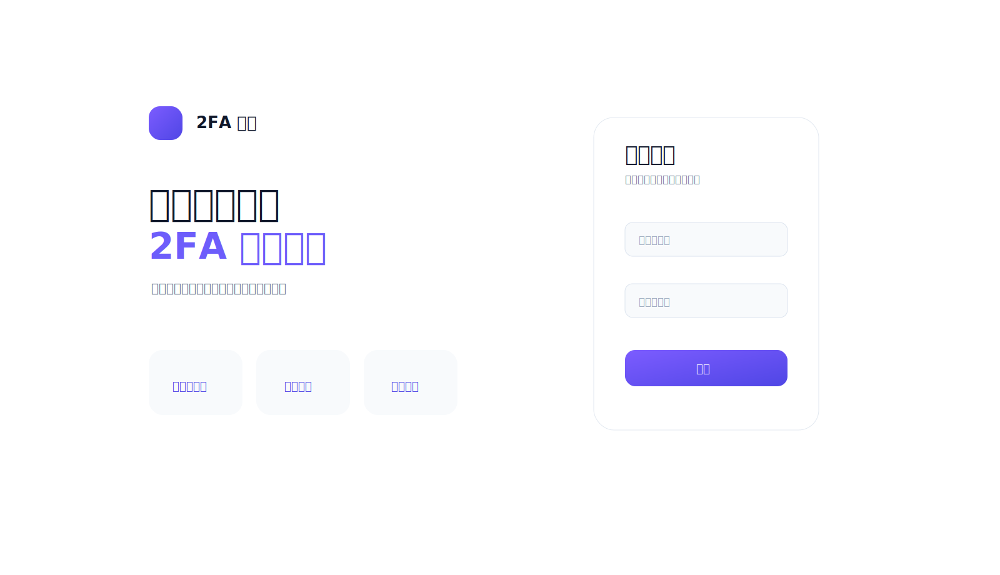
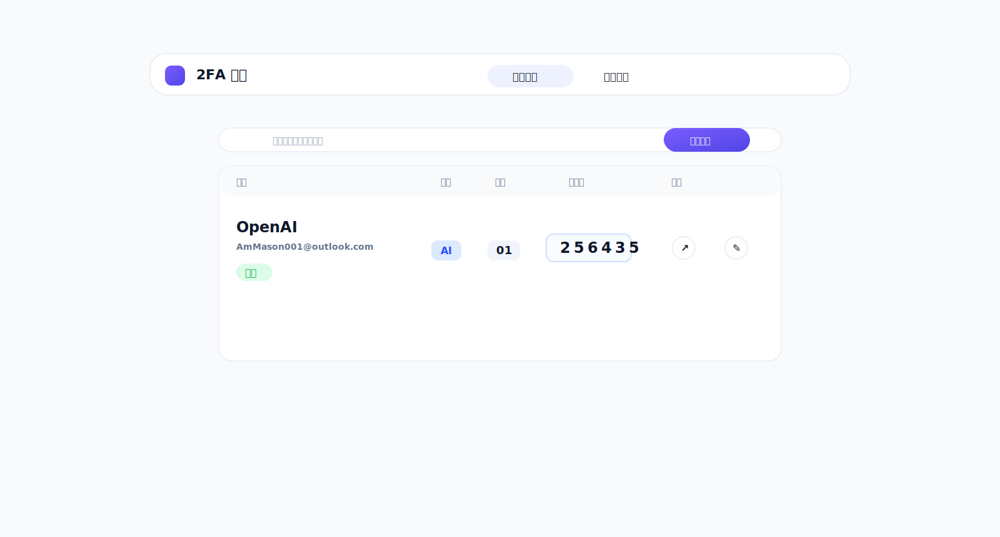
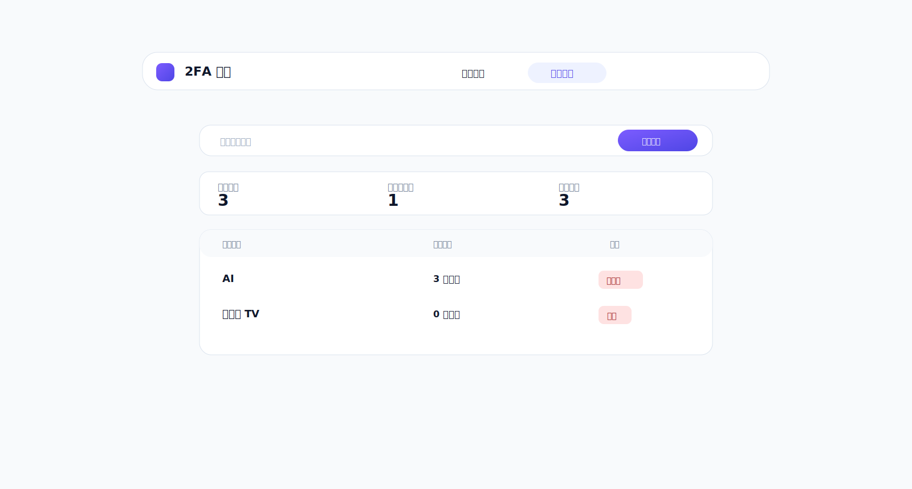
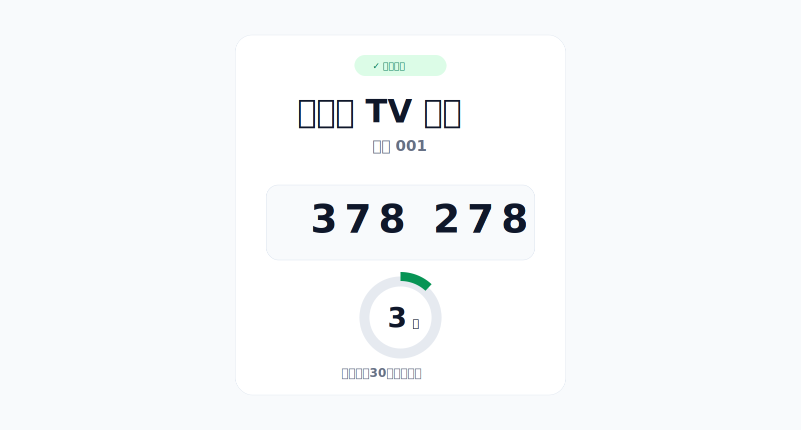

# CloudOTP

CloudOTP 是一个部署在 Cloudflare Workers + D1 上的 2FA/TOTP 管理看板。它可以集中保存 TOTP 密钥、实时生成 6 位验证码，并为每个账号提供独立的分享链接。

> 请只保存你有权管理的账号密钥。分享链接可以看到验证码，泄露后应立即停用或重置。

[](https://deploy.workers.cloudflare.com/?url=https://github.com/newszx/CloudOTP)



## 功能

- 管理员登录、CSRF 防护、12 小时会话
- 账号管理：名称、分类、编号、账号、备注、TOTP 密钥
- 分类管理：添加、搜索、删除空分类
- 验证码自动刷新，30 秒倒计时，一键复制
- 每个账号独立分享链接，支持停用、启用、重置、删除账号
- TOTP 原始密钥使用 Web Crypto AES-GCM 加密保存
- 适合 Cloudflare Workers + D1 自托管，无需服务器

## 页面预览







## 5 分钟部署

1. 点击上面的 `Deploy to Cloudflare`。
2. 登录 Cloudflare，按页面提示导入仓库。
3. 创建或绑定一个 D1 数据库，绑定名必须是 `DB`。
4. 添加 3 个变量：

| 变量 | 用途 |
| --- | --- |
| `ADMIN_PASSWORD` | 管理员密码 |
| `SESSION_SECRET` | 登录会话签名密钥 |
| `APP_ENCRYPTION_KEY` | 加密 TOTP 密钥的主密钥 |

建议这样生成随机密钥：

```bash
openssl rand -hex 32
```

5. 部署完成后，打开 Cloudflare 提供的 `workers.dev` 地址，使用用户名 `admin` 和 `ADMIN_PASSWORD` 登录。

> `APP_ENCRYPTION_KEY` 不要随意更换。更换后，旧数据里的 TOTP 密钥将无法解密。

## 首次使用

1. 进入「分类管理」，添加你需要的分类。
2. 进入「账号管理」，点击「添加账号」。
3. 填写账号名称、分类、编号、账号和 Base32 格式的 TOTP Secret Key。
4. 保存后，后台会显示验证码和分享链接按钮。
5. 点击分享链接按钮即可复制给需要查看验证码的人。

## 常用操作

- **复制验证码**：点击后台验证码，或在分享页点击「复制验证码」。
- **停用分享**：编辑账号后点击「停用分享」，旧分享页会变为无效。
- **重置分享**：编辑账号后点击「重置链接」，旧链接立即失效。
- **删除账号**：编辑账号后点击「删除账号」。
- **删除分类**：分类为空且不是「未分类」时才可删除。

## 本地开发

需要 Node.js 20 或更高版本。

```bash
git clone https://github.com/newszx/CloudOTP.git
cd CloudOTP
npm install
cp .dev.vars.example .dev.vars
npm run dev
```

运行测试：

```bash
npm test
```

远程部署：

```bash
npx wrangler login
npm run deploy
```

健康检查：

```text
https://你的域名/health
```

如果提示数据表不存在，执行远程迁移：

```bash
npm run db:migrations:apply
```

## 数据备份

请同时备份：

- Cloudflare D1 数据库
- `APP_ENCRYPTION_KEY`

只有数据库、没有原加密密钥时，已保存的 TOTP 密钥无法恢复。

## License

本项目供个人和团队自托管使用。使用前请确认你有权管理相关账号和 TOTP 密钥。
